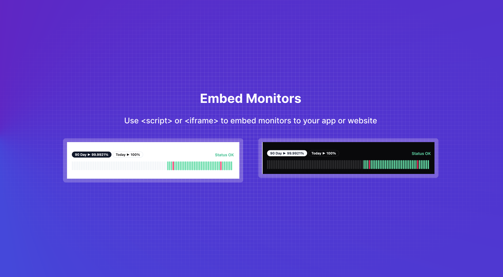
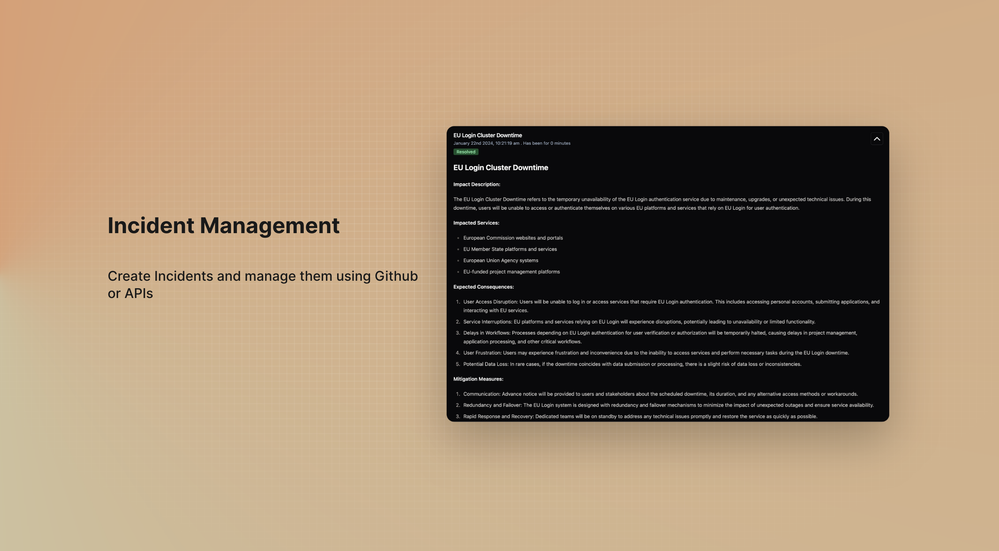
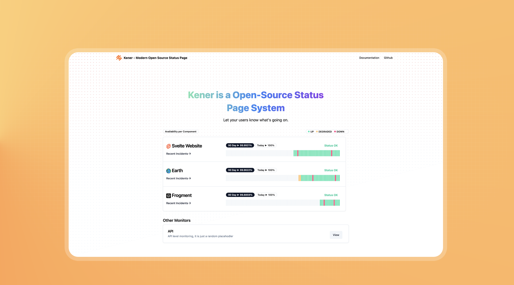

	

	
	
	

#### 👉 Truy cập máy chủ trực tiếp [tại đây](https://status.asakacloud.vn)

#### 👉 Đọc tài liệu tham khảo [tại đây](https://kener.ing/kener-docs)

# Kener - Hệ thống Trang Trạng thái

Kener: Công cụ trang trạng thái mã nguồn mở sử dụng Node.js, được thiết kế để giúp việc giám sát dịch vụ và xử lý sự cố trở nên dễ dàng. Nó cung cấp một giao diện đẹp mắt và thân thiện với người dùng, giúp đơn giản hóa việc theo dõi sự cố dịch vụ và cải thiện cách chúng ta giao tiếp trong quá trình xảy ra sự cố. Điều tuyệt vời nhất là Kener tích hợp liền mạch với GitHub, giúp việc quản lý sự cố trở thành một nỗ lực đồng đội—giúp chúng ta dễ dàng theo dõi và khắc phục sự cố cùng nhau trong môi trường hợp tác và thân thiện.

Nó sử dụng các tập tin để lưu trữ dữ liệu. Các adapter khác sẽ sớm ra mắt

## Tính năng

**Giám sát và Theo dõi:**

-   Giám sát thời gian thực
-   Khảo sát điểm cuối HTTP hoặc Đẩy dữ liệu để giám sát qua Rest APIs
-   Xử lý múi giờ cho khách truy cập
-   Phân loại Monitors thành các phần khác nhau
-   Lên lịch giám sát dựa trên Cron. Tối thiểu mỗi phút một lần
-   Cấu hình monitor linh hoạt bằng YAML. Tự định nghĩa cách phân tích monitor trạng thái UP/DOWN/DEGRADED
-   Xây dựng các API Poll phức tạp - Chain, Secrets v.v.
-   Hỗ trợ trạng thái mặc định cho Monitors. Ví dụ: defaultStatus=DOWN nếu không đánh dấu API mỗi phút với trạng thái UP
-   Hỗ trợ đường dẫn cơ bản cho hosting trong k8s
-   Hình ảnh docker được xây dựng sẵn để triển khai dễ dàng

**Tùy chỉnh và Thương hiệu:**

-   Trang trạng thái tùy chỉnh bằng yaml hoặc code
-   Tạo huy hiệu cho trạng thái và thời gian hoạt động của Monitors
-   Hỗ trợ tên miền tùy chỉnh
-   Nhúng Monitor dưới dạng iframe hoặc widget
-   Chủ đề Sáng + Tối
-   Hỗ trợ đa ngôn ngữ

**Quản lý Sự cố:**

-   Tạo Sự cố bằng Github Issues - Rich Text
-   Hoặc sử dụng API để tạo Sự cố

**Trải nghiệm Người dùng và Thiết kế:**

-   Điểm Accessibility 100%
-   Cài đặt và thiết lập dễ dàng
-   Giao diện thân thiện với người dùng
-   Thiết kế phản hồi cho nhiều thiết bị
-   Tự động SEO và sẵn sàng cho Mạng xã hội

## Các công nghệ sử dụng

-   [SvelteKit](https://kit.svelte.dev/)
-   [shadcn-svelte](https://www.shadcn-svelte.com/)

## Lấy cảm hứng từ

-   [Upptime](https://upptime.js.org/)

## Lộ trình

-   [x] Thêm API để tạo sự cố
-   [x] Thêm file docker
-   [ ] Thêm thông báo
-   [ ] Thêm adapter Mysql

## Ảnh chụp màn hình

Fork Lại Bởi Đức Mạnh
